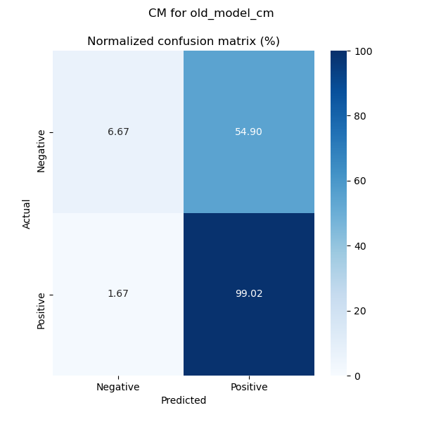
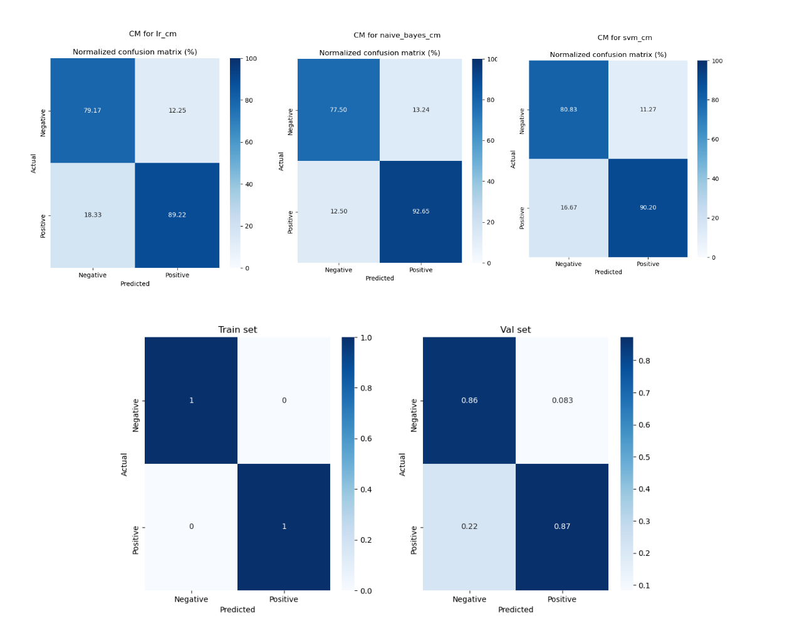
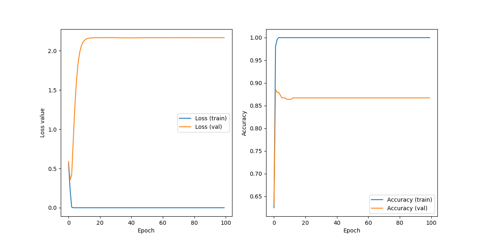

# Analyse de sentiments

L'analyse de sentiments est une technique de machine learning centrée autour de l'analyse de texte en NLP. Le corpus est composé d'éléments de texte à taille moyenne (de 100 à 500 caractères) et chacun de ces éléments est accompagné d'un avis qui peut être binaire (positif ou négatif) ou par gradation (note sur 5).

Il s'agit d'une tâche de classification où le but est d'associer un texte à un sentiment particulier, ce qui peut être utile pour évaluer la qualité d'un produit ou d'un service par les compagnies (ex. commentaires Amazon).

L'analyse de sentiments se décline en plusieurs types de tâches :

* Trouver le sentiment pour chaque mot, expressions, phrases ou sujets subjectifs
* L'extraction d'avis (opinion mining), l'analyse de sentiments telle qu'on la sous-entend

Un algorithme d'analyse de sentiments s'utilise avec des techniques NLP ou des algorithmes de ML traditionnels, basés sur la reconnaissance de similarités, comme Naive Bayes, Linear Regression, SVM et les techniques non-supervisées. Les métriques utilisés sont la précision, le rappel, le nombre de prédictions correctes et le score F1.

Au cours de cette expérimentation, j'ai testé 4 modèles différents : trois modèles de classification classiques qui sont la régression logistique, le Naive Bayes et les SVM, et un modèle de réseau de neurones dense.

## Pré-traitement

### Tokenisation et radicalisation

Le jeu de données a subi un prétraitement de manière à tokeniser et lemmatiser les commentaires dans le but de faciliter le travail de l'algorithme.

Les étapes de prétraitement se sont déroulées comme telles :

* Mise en minuscules
* Normalisation des caractères avec accents (ex. ê, è, ô, etc...)
* Suppression de la ponctuation
* Suppression des mots communs ou stopwords
* Radicalisation (stemming) des caractères

Au final, ce commentaire :

> C'est vrai cette boulangerie est bonne. Tradition délicieuse viennoiseries savoureuses pâtisseries et madeleines à tomber... Mais chaque fois que j'y vais cet accueil faussement aimable et faussement commerçant me frappe... Certaines serveuses prennent de grands airs dédaigneux imitant probablement la patronne qui n'a pas l'air...Plus

Se retrouve traité comme ceci :

> vrai cette boulangerie bonne tradition delicieuse viennoiseri savoureus patisseri madelein a tomber chaque foi vai cet accueil faussement aimable faussement commercant frappe certain serveus prennent grand air dedaigneux imitant probablement patronne a air plu

Ceci va permettre d'entraîner et d'évaluer la performance des modèles sur les commentaires passés en entrée. 


Le pré-traitement met en évidence des mots qui concernent le sujet en cours.

### Vectorisation

Comme les algorithmes ne peuvent pas traiter les caractères, le but est de trouver une méthode pour les transformer en chiffres. Du côté de la cible $y$ qui représente l'appréciation sur les commentaires, j'ai suivi le modèle original et j'ai associé 1 pour "positif" et 0 pour "négatif".

Pour le texte, j'ai privilégié la vectorisation par un Bag-of-Words style **TF-IDF**, pour valoriser les termes qui reviennent souvent dans le corpus dans le but de trouver plus efficacement les mots reliés aux commentaires positifs et vice-versa pour les commentaires négatifs.

TF-IDF est une matrice bag-of-words organisant le corpus en m-textes x n-mots selon deux calculs :

* Term Frequency (TF) qui relève le nombre de fois où un mot apparaît dans un texte.
* Inverse Document Frequency (IDF) qui est l'inverse du rapport entre le nombre de documents avec un mot spécifique et le nombre total de documents. 

Chacun des modèles utilisés a pris 80% de ces données en entrée pour l'entraînement, tandis que les 20% restants sont pour l'évaluation.

## Modèles

### Types de modèles

Les types de modèles classiques ont été générés à l'aide de la bibliothèque Scikit-Learn. Quant au modèle de réseau de neurones, il a été généré avec le framework PyTorch.

Les algorithmes de ML ont été réglés selon les données d'entrainement à l'aide d'une recherche en grille selon les hyperparamètres requis.

#### Régression Logistique

La régression logistique est une méthode classique de Machine Learning qui fonctionne bien sur les jeux de donnés binaires : elle sépare la première de la deuxième classe à partir d'un seuil. Le but est de trouver les bons paramètres pour définir ce seuil.

La régression logistique, comme son homologue linéaire, est pilotée par un terme de régularisation $C$ qui définit une marge de tolérance pour l'algorithme, ainsi qu'un domaine de pénalité, qui est LASSO (L1) ou Ridge (L2).

#### Support Vector Machines

Un autre algorithme utilisé cette fois dans les jeux de données de taille moyenne, le SVM fonctionne bien pour séparer deux jeux de données selon une limite vectorielle. Tout comme la régression logistique, il s'agit d'une méthode de seuillage qui prend en compte l'écart entre les groupes de points et cherche à faire correspondre la meilleure frontière possible.

Le SVM compte sur les hyperparamètres pour être le plus juste possible, afin de ne pas overfitter sur les données d'entraînement. Comme pour la régression logistique, on a le terme de régularisation $C$, mais également un algorithme de noyau qui gouverne sur les vecteurs de support.

Ces algorithmes sont soit linéaires, ou des fonctions de base radicale, la dernière gouvernée par un facteur $\gamma$. 

#### Naive Bayes

Très utilisé dans la détection d'e-mails frauduleux, le Naive Bayes est recommandé pour un jeu de données comme celui-ci. Il s'agit d'un algorithme de probabilités basé sur le théorème de Bayes, qui traite chacune variable de manière indépendante.

L'algorithme utilisé est la version multinomiale, qui est un classificateur adapté pour les comptes ou fractions de mots, comme la matrice bag-of-words passée en entrée. Celui-ci estime la probabilité $p$ qu'un mot apparaît dans un commentaire classé selon un label $y$.

Il prend un seul hyperparamètre, qui est le lissage $\alpha$, compris entre 0 et 1.

#### Réseau de neurones

Le réseau de neurones est une bonne structure lorsque les données sont trop complexes pour être classifiées avec un SVM (comme du texte) ou beaucoup trop denses pour du ML classique. Le modèle en question est un simple réseau de neurones composé de couches denses et de couches *dropout* :

```
SimpleNN(
  (dense1): Linear(in_features=5656, out_features=12673, bias=True)
  (drop1): Dropout(p=0.5, inplace=False)
  (dense2): Linear(in_features=12673, out_features=4000, bias=True)
  (drop2): Dropout(p=0.5, inplace=False)
  (dense3): Linear(in_features=4000, out_features=500, bias=True)
  (drop3): Dropout(p=0.5, inplace=False)
  (last_dense): Linear(in_features=500, out_features=2, bias=True)
)
```

Le résultat est la probabilité d'appartenance à chaque class pour chaque document.

## Résultats

 ### Critères d'entraînement

L'évaluation par recherche des meilleurs hyperparamètres a donné la configuration suivante pour chaque modèle :

* **Régression logistique :** pénalité L2, $C=48.33$
* **Naive Bayes :** $\alpha = 0.05$
* **SVM :** $C=3.59$, kernel RBF, $\gamma = 0.22$

Quant au réseau de neurones, il a été évalué selon une fonction de perte d'entropie croisée et un algorithme d'optimisation du taux d'apprentissage ADAM. Le taux d'apprentissage initial a été fixé à $10^{-3}$ et le modèle a été entraîné sur 100 époques. La taille de lot pour l'entraînement est de 256 tandis que la taille du lot de validation est de 64.

### Résultats

Les résultats ont été mesurés selon les critères suivants :

* **Justesse du modèle :** le nombre de prédictions correctes sur le nombre de prédictions totales.
* **Précision :** le taux de vrais positifs par rapport aux positifs trouvés. Il indique la fiabilité de l'algorithme en calculant la proportion de positifs supposés
* **Rappel** : le taux de vrais positifs par rapport aux positifs trouvés, qui vérifie la capacité de l'algorithme à dire si une donnée appartient à une classe en regardant la proportion de positifs capturés.
* **Score F1 :** moyenne harmonique entre précision et rappel.
* **Perte (pour le réseau de neurones) :** évolution de la fonction de perte au cours des époques.

Les modèles sélectionnés présentent une amélioration par rapport au modèle original.


Chacun des 4 modèles dépassent 85% de justesse. On remarque que le modèle original a de pauvres performances dans ses prédictions négatives. En effet, bien qu'il ait des performances correctes pour prédire les bons commentaires, il est trop biaisé dans ses prédictions :



Les autres modèles en revanche sont beaucoup plus équilibrés au sein de leur prédictions, avec des scores autour de 80% ou plus, grâce à l'optimisation de certains paramètres, mais aussi à la phase de pré-traitement qui a mis en avant les mots essentiels pour la classification. Si on se réfère au tableau ci-dessous :

|                 |     Original |   LogReg |  Naive Bayes |      SVM | Neural Network |
| :-------------- | -----------: | -------: | -----------: | -------: | -------------: |
| Accuracy        |     0.648148 | 0.854938 |  **0.87037** | 0.867284 |       0.867284 |
| f1-score (pos)  |     0.779923 | 0.885645 |      **0.9** | 0.895377 |       0.892231 |
| Precision (pos) |     0.643312 | 0.879227 |        0.875 | 0.888889 |   **0.912821** |
| Recall (pos)    | **0.990196** | 0.892157 |     0.926471 | 0.901961 |       0.872549 |
| f1-score (neg)  |     0.123077 | 0.801688 |     0.815789 | 0.818565 |   **0.827309** |
| Precision (neg) |          0.8 | 0.811966 | **0.861111** |  0.82906 |        0.79845 |
| Recall (neg)    |    0.0666667 | 0.791667 |        0.775 | 0.808333 |   **0.858333** |

On s'aperçoit que les modèles Naive Bayes et le réseau de neurones ont les meilleures performances. Naive Bayes affiche la meilleure justesse et un bon f1-score. En revanche, le réseau de neurones caractérise mieux la précision sur l'ensemble des positifs. Si on se réfère aux matrices de confusion, on observe quelque chose de particulier :



Le réseau de neurones classifie la plupart des commentaires positifs comme négatifs alors qu'il se trompe rarement sur les positifs. Comparé au modèles ML classiques, il a tendance à surclassifier ces commentaires en positifs tandis que les autres s'autorisent une marge d'erreur équivalente sur les deux. De plus, comme le montre la courbe d'évolution de la perte et de la justesse de ce modèle :



Il y a un déséquilibre entre les données d'entraînement et les données de validation. L'overfitting entre les deux courbes est clairement surligné, ce qui laisse à penser que le modèle utilisé est certainement surparamétré par rapport au jeu de données initial. Etant donné que le CSV de base est petit, il est certainement plus judicieux d'utiliser un modèle de ML classique, ou d'utiliser un modèle avec moins de neurones.